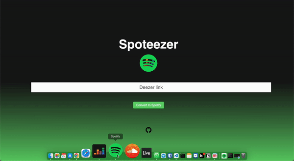
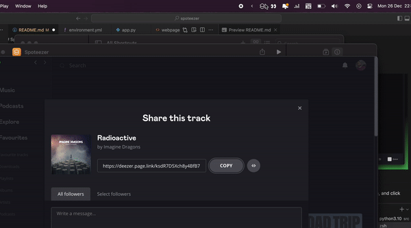

# Spoteezer


I am currently trying Deezer but have friends and family on Spotify.\
This repo will regroup some Deezer-to-Spotify utilities (and vice-versa).

[Online demo](https://rayan.daodnathoo.com/spoteezer)



## Installation

First, you should clone the repository and navigate to it:
```bash
git clone https://github.com/rayandaod/spoteezer
cd spoteezer
```

This project uses [`uv`](https://github.com/astral-sh/uv) for dependency management. Install `uv` if you haven't already:
```bash
curl -LsSf https://astral.sh/uv/install.sh | sh
```

Then, install the project dependencies:
```bash
cd spoteezer
uv sync
```

Add the following environment variables to your `.zshrc` / `.bashrc` / ... profile:

```bash
export SPOTIFY_CLIENT_ID='[your_spotify_client_id]'
export SPOTIFY_CLIENT_SECRET='[your_spotify_client_secret]'
```

You can get these information by creating a [Spotify developer app](https://developer.spotify.com/dashboard/applications).

## Usage

### Convert a Deezer link to a Spotify link (and vice-versa)

⚠️ Works for single tracks, albums, and artists

#### Command line

Using the project's `justfile` commands (recommended):
```bash
cd spoteezer
just run
```

Or manually:
```bash
cd spoteezer
uv run flask --app spoteezer.flask_app:app run
```

The Flask server will start on `127.0.0.1:8080`.

#### Flask app + HTML webpage

([Online demo](https://rayan.daodnathoo.com/spoteezer))

To run everything locally:

1. Start the Flask server:
   ```bash
   cd spoteezer
   just run
   ```
   Or manually: `uv run flask --app spoteezer.flask_app:app run`

2. Open `frontend/index.html` in your browser

The frontend is configured to communicate with the Flask server at `http://127.0.0.1:8080/convert`.

#### MacOS shortcut (Apple Shortcuts)



To do so, install the following shortcut and modify it to match your paths:
https://www.icloud.com/shortcuts/562d373485a84d6a9ac64e3df6bd19d1

You can also pin it to the menu bar as I did for a quicker access.

- Copy the Deezer or Spotify link to your clipboard.
- Run the shortcut.
- The resulting converted link shortly appears in your clipboard.
- Paste it wherever you want!

## Development

### Running tests

```bash
cd spoteezer
just test
```

Or manually:
```bash
uv run pytest
```

### Linting

```bash
cd spoteezer
just lint
```

Or manually:
```bash
uv run ruff check . --fix
```

### Type checking

```bash
cd spoteezer
just type
```

Or manually:
```bash
uv run ty check
```
