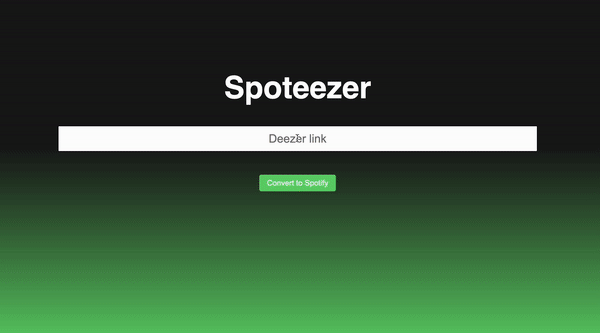

# Spoteezer
I am currently trying Deezer but have friends and family on Spotify.\
This repo will regroup some Deezer-to-Spotify utilities (and vice-versa).

## Installation

First, you should clone the repository and navigate to it:
```
git clone https://github.com/rayandaod/spoteezer
cd spoteezer
```

Then, you need to install some useful libraries.\
Best practice is to create a separate environment, so let's do that with conda.
```
conda env create -f environment.yml
conda activate spoteezer
```

Then create a file called `spotify_credentials.txt` at the root, and complete it as follows with your [Spotify developper app](https://developer.spotify.com/dashboard/applications) credentials:
```
[SPOTIFY_CLIENT_ID]
[SPOTIFY_CLIENT_SECRET]
```

## Usage

### Convert a Deezer link to a Spotify link

⚠️ Works for single tracks, albums, and artists

Make sure you are in the `src` folder and run:

#### Command line

`python convert_link.py [deezer_link]`

#### Flask App + HTML Webpage



Run `python app.py`\
Open `webpage.html`\
Enter the Deezer link in the input form as described in the gif above, and click _Convert to Spotify_.\
Click on the retrieved Spotify link to open it in a new tab.

#### MacOS Shortcuts

On MacOS, one can create a shortcut to easily launch this script.

To do so, install the following shortcut and modify it to match your paths:
https://www.icloud.com/shortcuts/562d373485a84d6a9ac64e3df6bd19d1

Copy the Deezer link in your clipboard and run the shortcut. The resulting Spotify link will shortly be copied to your clipboard. Paste it wherever you want!